# Intelligent-task-offloading-in-private-5G-networks
Private 5G network using Open5GS and srsRAN with COTS devices (5G smartphones, laptops). Implements an Intelligent Task Offloading framework to dynamically route computation between UE, MEC, and Cloud for low-latency, high-throughput applications.

---

## 1. Introduction
In the rapidly evolving digital landscape, next-generation mobile networks are expected to support latency-sensitive and compute-intensive applications such as natural disaster response, autonomous vehicles, and industrial IoT systems like drones. Traditional cloud-based computing models often fail to meet these stringent real-time requirements due to latency from distant data centers and network congestion. To address these challenges, Intelligent Task Offloading has emerged as a pivotal approach, enabling dynamic and adaptive distribution of computational tasks across edge and cloud resources based on real-time conditions.

This work implements a real-world 5G-enabled intelligent task offloading system that autonomously decides whether to process data locally at the edge or remotely in the cloud. The system architecture leverages an Open5GS-based 5G core and srsRAN radio access stack, deployed on an edge server, with a USRP B210 software-defined radio acting as the base station. A mobile device connects to this private 5G network and offloads data depending on computational context. Central to this system is an AI-driven LSTM model that predicts future CPU usage on the edge node, enabling proactive decisions. When the predicted load surpasses a predefined threshold, tasks are seamlessly redirected to a cloud server hosted on an OpenStack virtual machine.

This intelligent approach ensures low latency and high availability. The system integrates real-time monitoring, predictive analytics, and virtualization to optimize task allocation based on factors like CPU load, memory, and disk utilization. This report details the design and implementation of the Smart Task Offloading system, emphasizing the role of AI in load prediction, orchestration across heterogeneous infrastructures, and performance metrics. The proposed solution presents a scalable, adaptive framework to meet the demands of modern mobile networks while maintaining optimal Quality of Service (QoS) and resource utilization.

---

## 2. Problem Statement

**  To develop an intelligent data offloading in edge computing environments to optimize resource allocation, reduce latency. **

Edge devices often face resource constraints and high latency due to inefficient task handling. Traditional offloading methods are not adaptive to changing network and resource conditions, leading to poor performance in real-time and latency-sensitive applications. To address this, there is a need for an intelligent task offloading system that can dynamically optimize resource allocation and reduce latency, ensuring efficient execution and improved quality of service in edge computing environments.

### 2.1 Objectives of Proposed Work
- Set up a private 5G network using Open5GS and srsRAN.
- Set up edge and cloud environments using Kubernetes and OpenStack respectively.
- Design an intelligent task offloading algorithm that dynamically allocates tasks between edge and cloud nodes based on real-time results and predicted resource utilization.
- Evaluate the model.

---

## 3.  Requirement Analysis

### 3.1 Functional Requirements
-  The edge devices must be able to send data to the edge node servers.
-  The scheduler should be able to decide whether the task should be executed locally or in the cloud environment.
-  Edge and cloud nodes must be able to process the user’s task and send the result back to the requesting user.
-  The edge nodes must be able to upload data to the cloud storage in OpenStack.

### 3.2 Non Functional Requirements
- The throughput achieved during task execution at the edge should be increased by more than 50% compared to execution in the cloud.
- The latency measured when processing at the edge should be reduced by at least 30% compared to task execution in the cloud.

### 3.3 Minimum Hardware Requirements
- RAM: 32 GB
- Storage: 100 GB SSD or higher
- Processor: Multi-core CPU (Intel i7 or equivalent recommended)
- Base Station Hardware: USRP B210 Software Defined Radio

> 🫣 If you want you own private the cloud core then another device of same requirements is needed. We had used the servers for this purpose you can also opt to go with public cloud system but costs are applicable if not in free tier.

### 3.4 Software Requirements
- Operating System: Ubuntu 22.04 LTS   
- Development Tools: Visual Studio Code, Docker  
- Virtualization Platform: OpenStack (DevStack) 2025.1
- Container Orchestration: Kubernetes (MicroK8s)  
- Machine Learning Framework: TensorFlow

> 📒 More Detail refer our report (link of report).

---

## 3. System Design

  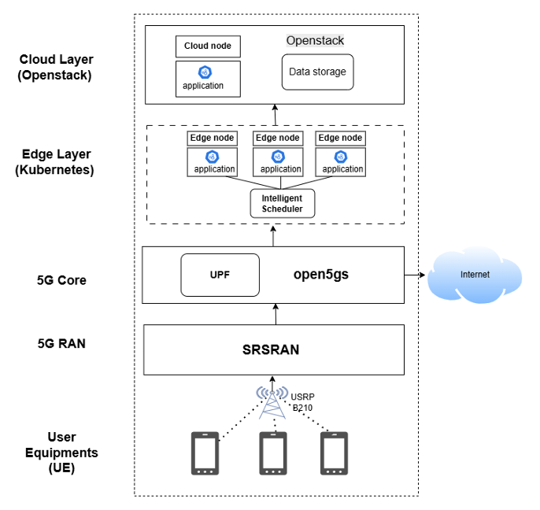

- **User Equipment (UE) Layer:** This layer consists of mobile devices (UEs) connected wirelessly via a 5G network. Communication is facilitated by a USRP B210 software-defined radio acting as the base station, which forms the Radio Access Network (RAN). These devices offload computation-intensive tasks to the network for processing.

- **Core Layer:** The core layer is implemented using Open5GS as the 5G core network. Within Open5GS, key network functions such as the Session Management Function (SMF) and User Plane Function (UPF) manage routing, session handling, and packet forwarding. This layer establishes and maintains connectivity between User Equipment (UEs) and the data processing layers, enabling seamless network registration and data flow.

- **Edge Layer (Kubernetes):** Serving as an intermediate layer between the core and cloud, the edge layer comprises multiple edge nodes running containerized applications orchestrated by Kubernetes. These nodes provide computation near the user, significantly reducing latency. A real-time LSTM-based intelligent scheduler operates within this layer, continuously analyzing resource utilization metrics such as CPU and memory usage to determine optimal task placement. If the edge nodes have sufficient resources, tasks are executed locally to ensure low latency and faster response times. This dynamic, predictive offloading decision is a core feature of the system.

- **Cloud Layer (OpenStack):** When the resource utilization of edge nodes exceeds a predefined threshold (30% CPU utilization), tasks are offloaded to cloud nodes. Data processed by both edge and cloud nodes are stored on virtual machines hosted on OpenStack. The cloud environment provides scalable computing power and storage for tasks requiring extensive processing or long-term archiving. Additionally, it acts as a backup in case of edge node failure.

---

## 4. Work Flow
1. User connects Private 5G network
2. User request to schedular `10.45.0.1:5001/predict` endpoint at the edge core (Kubernetes).
3. Schedular forword request to one of the selected node
    - Schedular for every 30 seconds requests the metrics such as CPU,MEMORY Utilization from the edge nodes
    - It predicts the future load of each node and select a best node that is below threshold value we had set during deployment.
    - If no edge node is availble below threshold value it forwards the request to cloud core (Openstack) deployed in remote server.
4. The Edge core or cloud core process the image and return the results to the user and send the processed data to the storage node in cloud core for future use.

  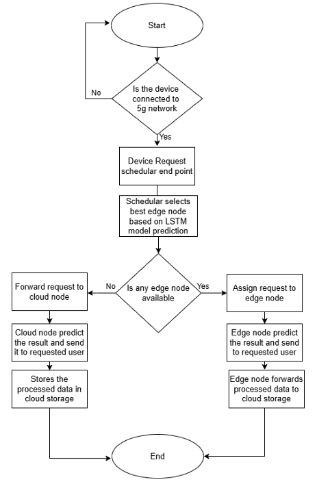

## 5. Implementation
> ⚡You can build all the Docker images mentioned in this project from scrach using **Build** or we have already mentioned the images built during setup in the configuration files.

- 📒 More Detailed Implementation: Refer to our report [click me](./Project%20Report/report.pdf).

---

## 6. Results and Analysis

The results are analyzed under different scenarios, each designed to evaluate the performance of intelligent task offloading under varying load conditions. We measured delay with MEC and without MEC, and specifically considered three scenarios: 
- 1. Performance with and without MEC
- 2. Load Applied on the Network through Edge Devices (User Equipment)
- 3. Load Applied Solely on the Edge Nodes (Kubernetes Pods)
- 4. Load Applied on Both the User Devices and Edge Nodes Simultaneously
These scenarios allow us to assess how effectively the system adapts to dynamic workload distributions and to evaluate the behavior of the LSTM-based scheduler under real-time offloading conditions. The detailed analysis for each scenario is presented below.

### 6.1 Performance Evaluation With and Without MEC

#### 🤠Latency Comparison Across Tasks👀

> ⚡⚡Latency comparison across 10 task instances, with and without Mobile Edge Computing (MEC) deployment. For all 10 instances, the latency with MEC is significantly lower, indicating faster task processing due to edge-localized computation. Without MEC, higher latency values occur consistently, reflecting the overhead of offloading tasks to distant servers. These results clearly demonstrate the performance advantages of MEC in reducing task offloading delays across multiple instances.

  

#### 🤠Average Latency Comparisons👀

> ⚡⚡ The average latency between scenarios with and without MEC deployment is compared. The average latency with MEC is significantly lower at 579.09 ms, compared to 1117.13 ms without MEC. This highlights the effectiveness of MEC in reducing processing delays by bringing computation closer to the edge.

  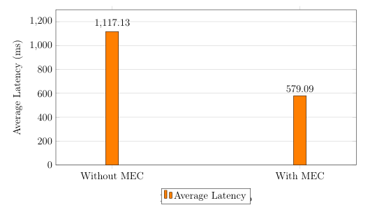

#### 🤠Throughput Comparisons👀

> ⚡⚡ The average throughput comparison between deployments with and without MEC shows that throughput nearly doubles with MEC deployment, increasing from 1.71 Gbps to 3.31 Gbps. This demonstrates MEC’s capability to enhance data transmission efficiency by processing closer to the source.

  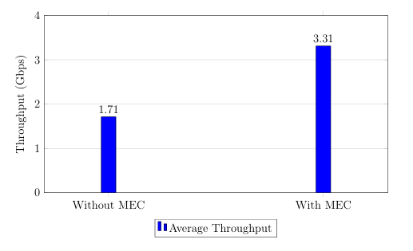

### 6.2 Performance Evaluation in Network by Varying Load on End Devices

#### 🤠Latency Comparison Across Tasks👀

> ⚡⚡ The task offloading latency across 10 instances with and without load on the edge device shows that latency significantly increases when the edge device is under load, with some tasks experiencing delays over 5000 ms. Without load, latency remains consistently lower, typically under 1000 ms. This highlights how device load adversely impacts offloading performance and response times.

  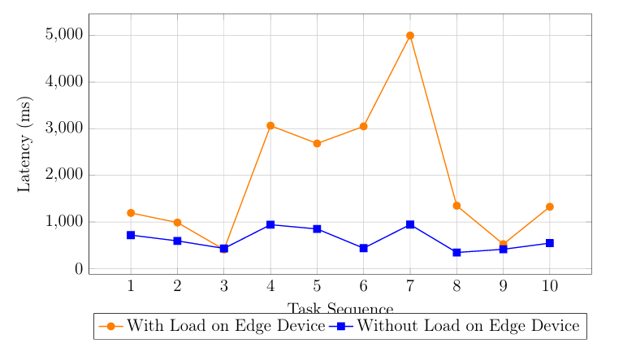

#### 🤠Average Latency Comparisons👀

> ⚡⚡ The average latency comparison with and without load on the edge device shows that latency is significantly higher when the edge device is under load, reaching nearly 1959 ms. Without load, the average latency reduces substantially to about 622 ms, demonstrating the impact of device load on performance.

  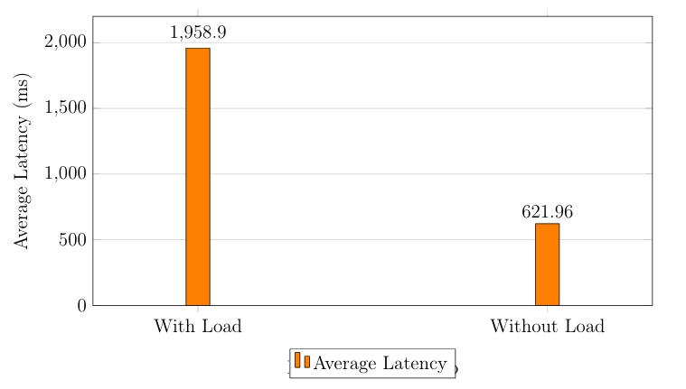

#### 🤠Throughput Comparisons👀

> ⚡⚡ The average throughput comparison with and without load on the edge device shows that throughput decreases to 0.98 Mbps under load conditions. Without load, the throughput improves markedly to 3.08 Mbps, highlighting the effect of edge device load on data transmission performance.

  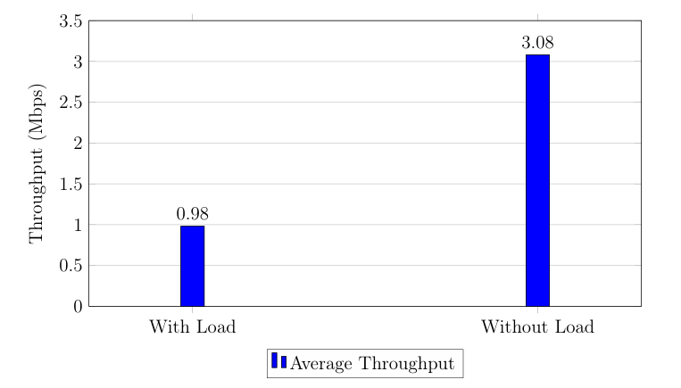

### 6.3 Performance Evaluation by Varying Load on Edge Nodes

#### 🤠Latency Comparison Across Tasks👀

> ⚡⚡ The upload latency per request across 10 instances is consistently higher under load on the edge node, reaching up to 3104.47 ms. Without load, latency remains stable and low, around 700–800 ms, highlighting the significant impact of edge node load on upload latency performance.

  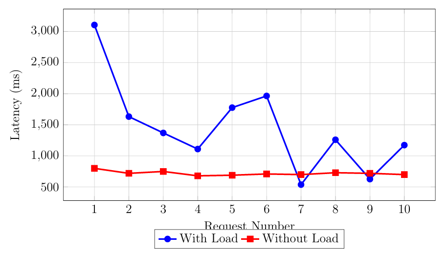

#### 🤠Average Latency Comparisons👀

> ⚡⚡ The average latency comparison with and without load on the edge node shows that latency nearly doubles under load, increasing from 720 ms to 1455.48 ms. This demonstrates the substantial impact of edge node load on system responsiveness.

  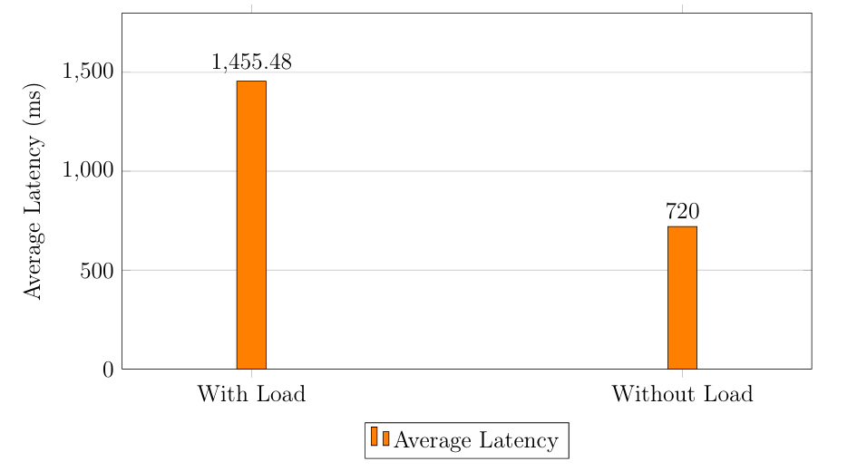

#### 🤠Throughput Comparisons👀

> ⚡⚡ The average upload throughput comparison with and without load on the edge node shows a decrease from 1.85 Mbps without load to 1.32 Mbps under load. This highlights the negative impact of edge node load on data transmission efficiency.

  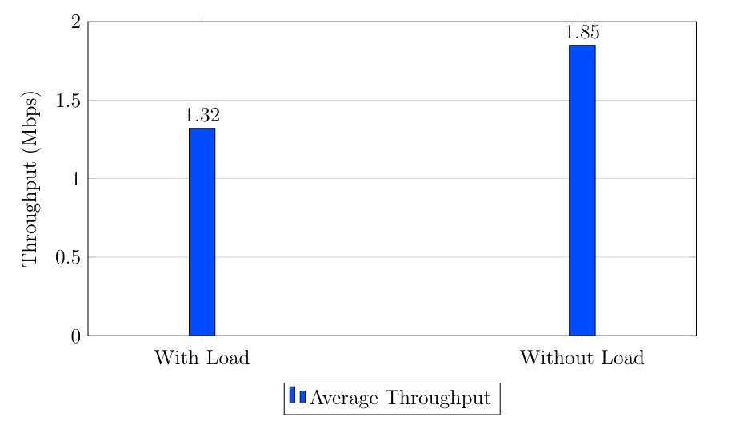

### 6.4 Performance Evaluation by Varying Load on Edge Node and End Device

#### 🤠Throughput Comparisons👀

> ⚡⚡ The upload latency for 10 individual requests under load conditions varies significantly, ranging from a high of 5853.45 ms (Request 3) to a low of 449.55 ms (Request 10). This variability underscores the inconsistent performance of the system when the edge device is operating under load.

  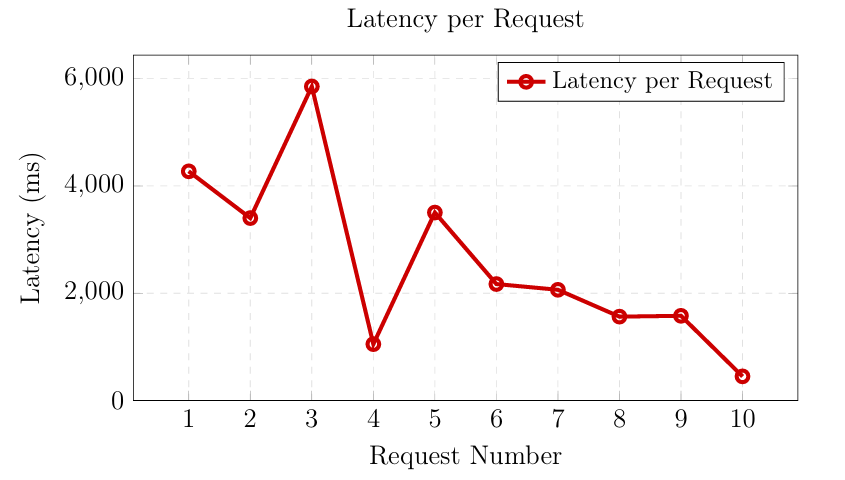

|        Metric         |   Value   |
| Average Latency (ms)  | 2590.33   |
| Average Throughput (Mbps) | 0.74  |

> ⚡⚡ The above table shows average latency and throughput measured under varying load conditions on both edge nodes and edge devices show a latency of approximately 2590.33 ms, reflecting the total time taken for task offloading and execution under load. The throughput, observed at 0.74 Mbps, indicates the data transmission rate during this process. These values help in assessing the performance impact when system resources are stressed.

